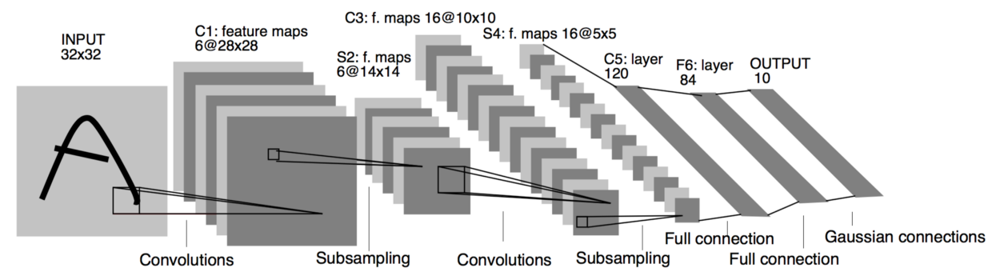

LeNet-5 architecture as published in the original paper.

This is a Modified implementation of Original LeNet-5 model

## Model Summary

Original LeNet-5 model has:

    - 2 Convolutional layers.
    - 3 Fully connected layers.
    - 2 Average pooling layers.
    - Tanh as activation function for hidden layer.
    - Softmax as activation function for output layer.

## Activation Function

Here, ReLU is used instead of Tanh/Sigmoid function.
## Pooling Layer

Here, Max Pooling is used instead of Average Pooling.

## References

[[1](http://yann.lecun.com/exdb/publis/pdf/lecun-98.pdf)] Y. LeCun, L. Bottou, Y. Bengio, and P. Haffner. "Gradient-based learning applied to document recognition." Proceedings of the IEEE, 86(11):2278-2324, November 1998.

